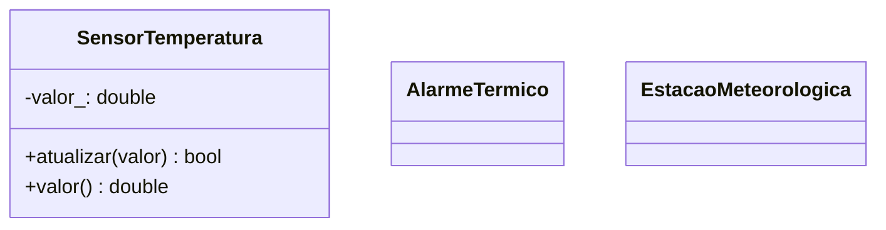

# Diagrama da estação meteorológica

Complete as relações, multiplicidades, atributos e operações que faltam. O diagrama final deve corresponder ao código entregue.

```mermaid
classDiagram
    class SensorTemperatura {
        -valor_: double
        +atualizar(valor) bool
        +valor() double
    }
    class AlarmeTermico {
        %% TODO: estado e operações públicas
    }
    class EstacaoMeteorologica {
        %% TODO: partes e operações públicas
    }
    %% TODO: composição e multiplicidades
```
